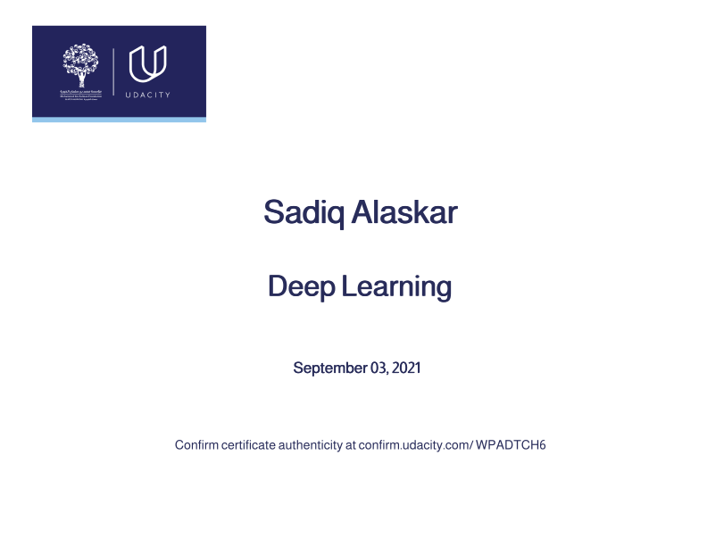

# My Udacity Deep Learning Nanodegree:
This is a storage repository about the projects that I have done while taking Udacity Deep Learning Nanodegree Course.

# Projects:
1. First Neural Network (Feedforward Neural Network).
2. Landmarks Project (Convolutional Neural Network).
3. TV Script Project (Recurrent Neural Network using LSTM).
4. Face Generator Project (Generative Adversarial Neural Network).
5. Amazon SageMaker Deployment ( Deployment of a model using Amazon SageMaker).

# Certificate:

